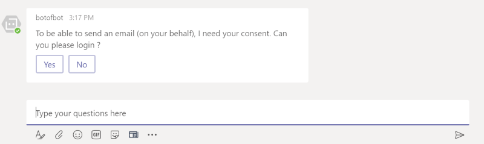
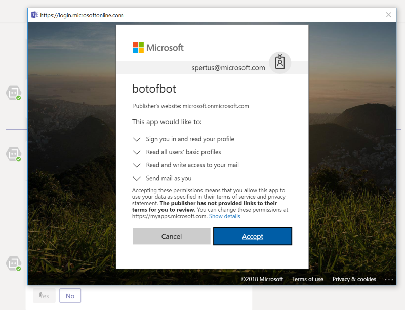

# Proactive conversation in MS Teams & Graph / Auth interaction

## Introduction

This sample is a straightforward sample showing several interesting points when you want to develop a bot within Microsoft Teams.   
The idea of this sample is to sending a **proactive message** to an employee, using a **bot** within **Microsoft Teams** asking him to provide a first support to a user

In a nutshell, this sample contains:

- Sending a **JSON payload** to your bot (registered in MS TEAMS), enabling him to send you (acting as the support employee) a proactive message, in a 1:1 conversation.
- A simple workflow to request consents (to be able to send an email) using **Azure Active Directory** authentication.
  - We will use a modified version (to be more easy to understand) of the [Microsoft Teams Authentication Sample](https://github.com/OfficeDev/microsoft-teams-sample-auth-node)

We will use:

- [TypeScript](https://www.typescriptlang.org/) (the last version was 2.9 when this article was written).
- [Bot Framework for Node.JS](https://dev.botframework.com/) : the NodeJS version of the botbuilder.
- [Azure redis cache](https://docs.microsoft.com/en-us/azure/redis-cache/) to save the needed properties we need to send a proactive message.
- A [Node.JS Express](http://expressjs.com) application, supporting your routes and the bot itself.

Here is the simplified schema of the whole scenario:


## Getting start

Before running this sample, you need to:

- Set up a tunneling service such as [ngrok](http://www.ngrok.io).
- Register a bot in [Microsoft Bot Framework](https://dev.botframework.com/).
- Configure the app so it runs as the registered bot.
- Create an [app manifest and the zip package](https://docs.microsoft.com/en-us/microsoftteams/platform/concepts/apps/apps-package) and [sideload the app into Microsoft Teams](https://docs.microsoft.com/en-us/microsoftteams/platform/concepts/apps/apps-upload)
  - You should take a look on [MS Teams App Studio](https://docs.microsoft.com/en-us/microsoftteams/platform/get-started/get-started-app-studio). This application can help you creating your manifest.
  - This sample contains a straightforward manifest template file, as well.

## Config files

You don't want to commit your sensitive config files in any public repository, that's why you won't find anything in this repository (even in the history :o ):

- The `.env` config file. Instead, take the `.env.template` file, make a copy, renaming to `.env` and fill the values
  - You will need the **redis** informations (hostname/password) and the **Bot** (appid/apppassword) as well.
- The `/package/manifest.json` manifest file. Again, make a copy of `/package/manifest.template.json`, rename, and fill the correct values.
  - You will need the bot id (a GUID) and at least the correct **ngrok** url.

> All thoses files are marked as *ignored* in the `.gitignore` file:
``` cmd
# build folder for TS generated code
/build

# package
/package/manifest.json
/package/*.zip

# dotenv environment variables file
.env

```


## Redis

We need a cache system to be able to get and set some various informations from the bot, to be able to launch a proactive message.   
In this sample, we are using [Azure redis cache](https://docs.microsoft.com/en-us/azure/redis-cache/) but you can use your own redis server.   
Don't forget to fill the correct values in the `.env` file (**REDIS_CACHE_HOSTNAME** / **REDIS_CACHE_PASSWORD** / **REDIS_CACHE_TEAM_KEY**)

> The hostname and password comes from your redis server configuration. the team_key is a key you have to create. Think simple :) something like "1" or "teamredis" will be fine

## Ngrok

To be able to use the application within Microsoft Teams, you need to use a tunnel, if you plan to test it on your local dev machine.   
[Ngrok](http://www.ngrok.io) is a really useful tool to be able to tunnel your local traffic to an https endpoint.

Use this commandline to tunnel your `http://localhost:3000` to `https://something.ngrok.io`

``` cmd
ngrok http --region=eu 3000
```


You will receive a new `https` endpoint (in the screenshot, `https://d5c1a468.eu.ngrok.io`)
You need this endpoint in several parts of your code and configuration:

- The endpoint property in the bot registration channel (from the [Azure portal](http://portal.azure.com) )
- The Microsoft teams manifest file (located in `/package/manifest.json`)
- The redirect URI from your application manifest (from the [Microsoft apps dev portal](https://apps.dev.microsoft.com))

## Authentication : Azure Active Directory

Registering a bot with the Microsoft Bot Framework automatically creates a corresponding Azure AD application with the same name and ID.

- Go to the [Application Registration Portal](https://apps.dev.microsoft.com) and sign in with the same account that you used to register your bot.
- Find your application in the list and click on the name to edit.
- Click on "**Add platform**", choose "**Web**", then add the following redirect URLs: 
  - `https://<your_ngrok_url>/auth/callback`
- Scroll to the bottom of the page and click on "Save".
- The bot uses **MICROSOFT_APP_ID** and **MICROSOFT_APP_PASSWORD**, so these should already be set. No further changes needed!

## Workflow

### Saving useful informations in redis

Once the application is installed as a sideloaded application, the bot will raise a first `conversationUpdate` event, with the bot, as the first (and only one) added member.   
This is the correct moment to get useful informations and saved them in our redis cache.

``` ts
bot.on('conversationUpdate', async (message) => {

  if (message.membersAdded) {
    message.membersAdded.forEach((identity: builder.IIdentity) => {

      // bot is just registered (application is just installed)
      if (identity.id === message.address.bot.id) {
        setredisCache(message)
      }

      // a new member is coming
      if (identity.id !== message.address.bot.id) {
        bot.beginDialog(message.address, "greeting:start");
      }
    });
  }
});


async function setredisCache(message: any) {

  let teamCache: ITeamCacheData = {};

  if (message.address && message.address.conversation)
    teamCache.conversationId = message.address.conversation.id;

  if (message.address && message.address.serviceUrl)
    teamCache.serviceUrl = message.address.serviceUrl;

  teamCache.teamsId = utils.getTeamId(message);
  teamCache.tenantId = utils.getTenantId(message);

  if (teamCache.serviceUrl && teamCache.teamsId && teamCache.tenantId && teamCache.conversationId) {
    await cache.setTeamCacheAsync(teamCache);
  }

}
```

> If you want to raise this event, don't forget to run your application **BEFORE** installing the application in MS TEAMS (when uploading the zip file as a sideloaed app)

### Proactive message

Thanks to the last step we did, we have everything we need to send a proactive message.  
We receive a JSON payload, containing at least the user we want to reach.

In a nutshell, we should be able to:

- Identify the correct user (by getting all the team members)
- Get the config from redis
- Create a new message to begin a new 1:1 dialog

Here are two interesting piece of code, you should take a look in :

In `services/routerServices.ts`:

```ts
this._router.post("/api/welcome", async (req, res) => {

    // try to get the team cache
    let teamCache: ITeamCacheData;

    try {
    teamCache = await this._cache.getTeamCacheAsync();

    } catch (error) {
        res.status(400);
        return res.send({ error: "cache is not available" });
    }

    if (!req.body) {
        res.status(400);
        return res.send({ error: "payload is not available" });
    }

    // getting the users
    let users = await utils.getMembersAsync(
            this._connector,
            teamCache.conversationId,
            teamCache.serviceUrl
        );

    // getting the right user if exists in the team
    let user = users.find(u => u.email === req.body.contactEmail || u.userPrincipalName == req.body.contactEmail);

    if (!user) {
        return res.sendStatus(404);
    }

    let settings = {
        serviceUrl: teamCache.serviceUrl,
        appId: this._teamSettings.appId,
        appName: this._teamSettings.appName,
        tenantId: teamCache.tenantId,
        userId: user.id
    };

    utils.sendProactiveMessage(this._bot, "newcomer:welcome", settings, req.body);

    return res.sendStatus(200);
});
```

In `utils/messageUtils`, the method to create the correct address and begin the dialog:

``` ts
export async function sendProactiveMessage(bot: builder.UniversalBot,
    dialogId: string,
    settings: { serviceUrl: string, appId: string, appName: string, tenantId: string, userId: string },
    args: any) {

    // generate the correct address
    var address = {
        channelId: "msteams",
        user: { id: settings.userId },
        channelData: {
            tenant: {
                id: settings.tenantId
            }
        },
        bot: {
            id: settings.appId,
            name: settings.appName
        },
        serviceUrl: settings.serviceUrl,
        useAuth: true
    };

    // begin a new dialog with the correct user
    bot.beginDialog(address, dialogId, args);

}
```

### Authentication

This sample uses the code from the [Microsoft Teams Authentication Sample](https://github.com/OfficeDev/microsoft-teams-sample-auth-node).   
The code used here is modified, and will only use the `Azure Active Directory` provider.  
You will find all the code required in several files:

- `/authentication/providers/azureAdProvider.ts` : Azure AD provider, getting the required url to 
  - Get the correct authentication url.
  - Get an access token and a refresh token.
  - Renew the access token, using a refresh token.
- `/authentication/authBot.ts` : Override of the `UniversalBot` to ensure the callback of the `OAuth2` process.
- `/authentication/authDialog.ts` : A simplified version of an auth dialog, asking for authentication if the user is not already authenticate, otherwise end the dialog
- `/authentication/authUtils` : Some usefuls methods to retrieve, save and analyze the authenticated token.

Using thoses classes / function is really straightforward.  
Look the auth library in `/librairies/authLibrary.ts` and check the code to use the `authDialog`:

``` ts
// register the auth dialog in the library to be able to call it from a IDialogWaterfallStep element
lib.dialog('login', new auth.AuthDialog(oauthProvider));

lib.dialog('start', [
    async (session, args, next) => {

        let isAuthenticated = auth.isAuthenticated(session, oauthProvider.providerName);
        if (!isAuthenticated) {
            session.beginDialog("auth:login");
        } else if (auth.isTokenExpired(session, oauthProvider.providerName)) {
            let userToken = auth.getUserToken(session, oauthProvider.providerName);
            let newUserToken = await oauthProvider.getAccessTokenWithRefreshTokenAsync(userToken.refreshToken);
            auth.setUserToken(session, oauthProvider.providerName, newUserToken);

        }
        next();
    },
    async (session, results) => {
        return session.endDialog();
    }

]).triggerAction({ matches: /^auth/i, });;
```

If you're not already logged, the bot will invite you to log in, using your teams account, by default:





If you need any assistance, or if you have any questions, do not hesitate to fill an issue or contact me by twitter [@sebpertus](http://www.twitter.com/sebpertus).

And a big thanks to [rasmusjuhl](https://github.com/rasmusjuhl) for his help !

Seb